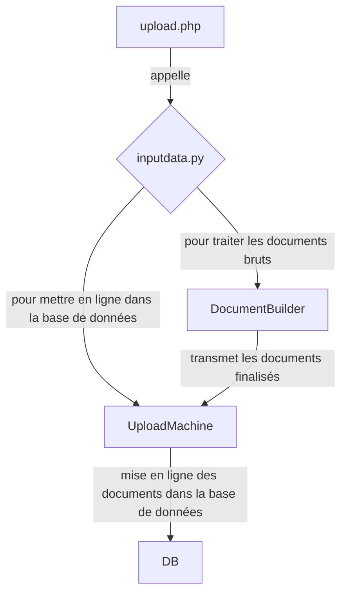

# Python

## Système d'upload
Le système d'upload s'occupe d'ouvrir les fichiers mis en ligne par l'utilisateur, de les traiter et de les mettre dans la base de données.

## Récupération des processeurs et parsers
Les scripts `generate_processors.py` et `generate_parsers.py` permettent à un script javascript de récupérer la liste des éléments disponibles et de proposer les options adéquates.

## Système d'export
Non finalisé. Il utilise les *producers* pour générer du texte à partir des données dans la DB.