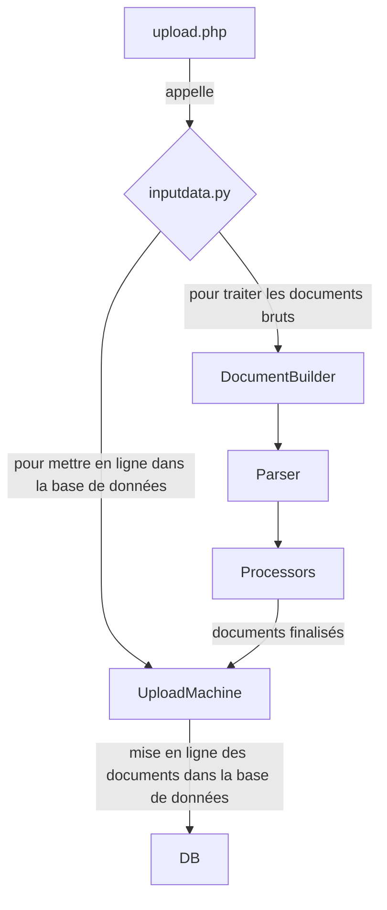

# Python

## Système d'upload
Le système d'upload s'occupe d'ouvrir les fichiers mis en ligne par l'utilisateur, de les traiter et de les mettre dans la base de données.

### Documents
Le système intègre un ensemble de classes `Document` (dans [FileProcessing/Document.py](/python/FileProcessing/Document.py)). Chaque classe est liée à une étape de traitement,
 et intègre un système de contraintes pour vérifier l'intégriter des donnes à chacune de ces étapes. Le traitement fera alors évoluer le document vers la classe suivante, 
 à partir du moment où les bonnes données sont fournies.

### Processeurs
Les processeurs sont les classes qui permettent le traitement des textes (tokenisation, étiquetage, lemmatisation, analyse syntaxique).
Chaque classe présente dans le dossier [FileProcessing/Processors](/python/FileProcessing/Processors) héritant d'une des classes présentes dans [FileProcessing/ProcessorInterfaces.py](/python/FileProcessing/ProcessorInterfaces.py) est considérée comme un processeur.
Les différentes classes abstraites permettent de dénoter une fonction particulière implémentée par le processeur : tokenisation, étiquetage, etc. 

### Parsers
Les parsers sont des classes qui s'occupent de traiter les fichiers en entrée, *avant* de les envoyer aux processeurs. Cela permet d'extraire les données d'un fichier CoNLL-U par exemple.
Un parser peut renvoyer n'importe quel type de `Document`, auquel cas les étapes déjà réalisées seront ignorées.

## Récupération des processeurs et parsers
Les scripts [generate_processors.py](/python/generate_processors.py) et [generate_parsers.py](/python/generate_parsers.py) permettent à un script javascript de récupérer la liste des éléments disponibles et de proposer les options adéquates.

## Système d'export
Non finalisé. Il utilise les *producers* pour générer du texte à partir des données dans la DB.